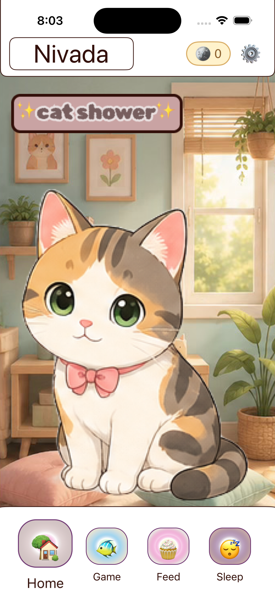
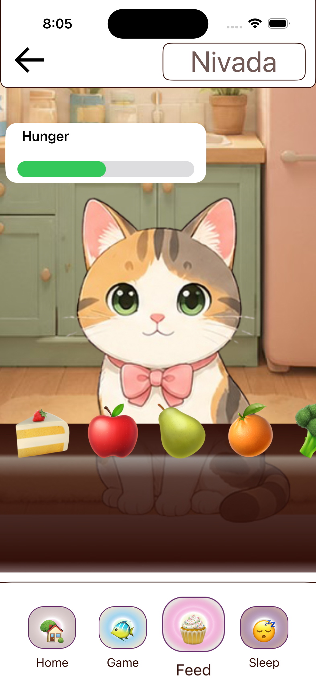
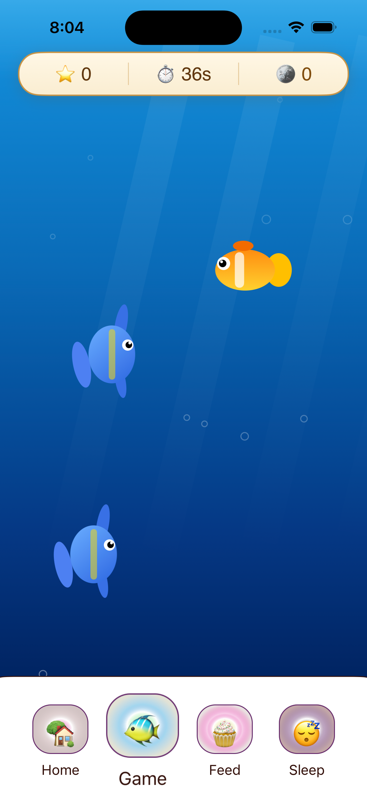

# MYPetCat
Virtual pet iOS app built with SwiftUI and MVVM.

## About
A virtual pet iOS app where users care for a pet cat by feeding it, helping it sleep, earning coins, and playing mini-games.

## Features
- Feed the cat
- Sleep system
- Energy levels
- Coin rewards
- Fish Catch mini-game
- Timers
- Responsive SwiftUI interface

## Built With
- Swift
- SwiftUI
- MVVM
- Xcode

## Screenshots

  
\
  
\
  

## Future Improvements
- Shop system
- Pet customization
- Save progress
- Daily rewards
- Notifications

## Author
Haleema Naeem

